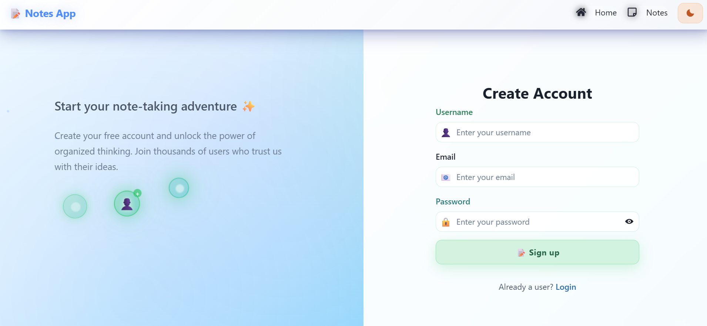

# 📝 React Notes App

A full-stack Notes application built with the **MERN stack** (MongoDB, Express, React, Node.js). It features full **CRUD operations**, **JWT authentication**, and a clean UI for managing personal notes using interactive visual cards.

---

## 🚀 Tech Stack

- **Frontend**: [React](https://react.dev/), [Chakra UI](https://chakra-ui.com/), Redux, Axios
- **Backend**: [Node.js](https://nodejs.org/), [Express](https://expressjs.com/)
- **Database**: [MongoDB](https://www.mongodb.com/), [Mongoose](https://mongoosejs.com/)
- **Authentication**: [bcrypt](https://www.npmjs.com/package/bcrypt), [JWT](https://jwt.io/)
- **Deployment**: Backend on [render](https://render.com/), Frontend on [Vercel](https://vercel.com/)

---

## 🔐 Features

- JWT-based user authentication
- Password encryption with bcrypt
- Protected routes for note operations
- Notes displayed as visual cards with update/delete actions
- Responsive UI with Chakra UI components
- Redux state management for user and note actions

---

## 🌐 Deployment

- **Frontend**: Deployed on [Vercel](https://vercel.com/)
- **Backend API**: Deployed on [Render](https://render.com/)

---

## 📸 Screenshots

### 🔑 Login Page

### 🆕 Signup Page

### 📝 Notes Page

---

## 🙌 Inspiration

This project was inspired by [**Arun Opal’s React Notes App**](https://github.com/arunopal/react-notes-app).  
Huge thanks to him for the original concept and structure that guided this build.

---

## 🤝 Contributing

Contributions are welcome! Feel free to open issues or submit pull requests.

---

## 📬 Contact

For any questions or feedback, feel free to reach out!

